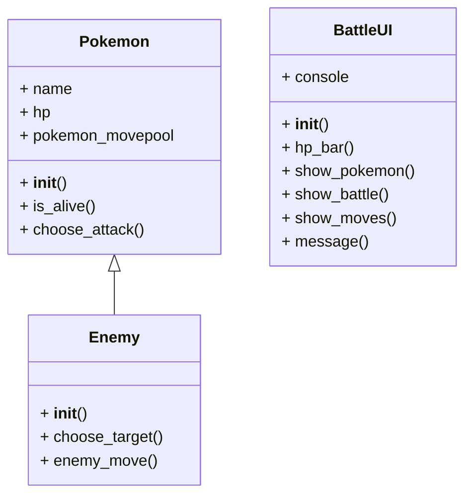

```mermaid
classDiagram
    class Pokemon {
        + __init__()
        + name
        + hp
        + pokemon_movepool
        + is_alive()
        + choose_attack()
    }

    class Enemy {
        + __init__()
        + choose_target()
        + enemy_move()
    }

    Pokemon <|-- Enemy

    class BattleUI {
        + __init__()
        + console
        + hp_bar()
        + show_pokemon()
        + show_battle()
        + show_moves()
        + message()
    }
```